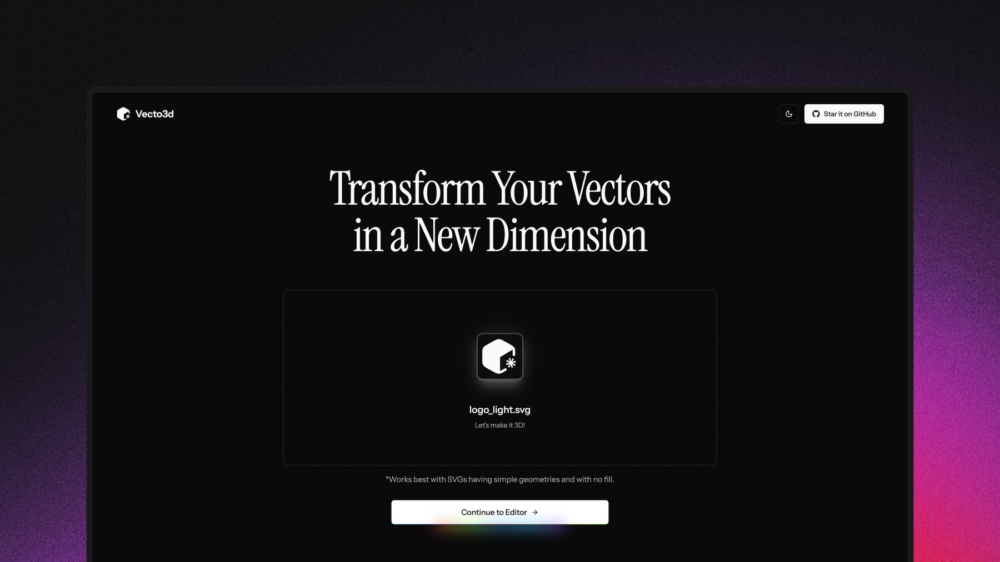

<h1 align="center">Vecto3d</h1>

A super simple tool to convert your simple SVG's mostly logos to 3D models.
Check it out at [https://vecto3d.xyz](https://vecto3d.xyz).

## But why?

So, one day I was bored and decided to open Blender. I loaded up a logo that I designed in Figma (check it out [here](https://x.com/blakssh/status/1895902171788689741)) and then started playing around with the different tools to make it 3D. I knew that you can convert any svg to 3D models in blender but I wanted to make it easier and faster. So I checkout the web and found a few tools but they were pretty much paid or has no 3D model export feature. So I thought why not make a tool that can do this easily and quickly :)

## What can you do with this?

- Convert your simple SVG's to 3D models
- Multiple customization options which includes Geometry, Materials, Environment and Background with a simple intuitive UI.
- Customize your 3D models with the how much thickness you want or bevels.
- Experiment with different colors and materials (Glass, Metal, Plastic, etc.)
- Preview your 3D models in different enviroments and can also add your own custom environment using any image you want.
- Download the 3D model in STL, GLB and GLTF formats.
- Can Export images in PNG in HD, 2K and 4K quality.
- Can change the background color of the preview panel to see the 3D model in different colors.

## Vibe Mode

Since vibe coding is in trend right now, I thought why not add a vibe mode to this app. So I added a button to toggle the vibe mode. This mode allows you to add a dreamy effect with bloom and soft shadows to your preview panel.

## Acknowledgements

I've used multiple tools to make this app, specially [V0.dev](https://v0.dev) for quick prototyping, [shadcn/ui](https://ui.shadcn.com) and [Magic UI](https://magicui.design/) for the amazing UI components.

## License & Contributing

Use it as you want, but please give me credits by tagging me on [X (Twitter)](https://x.com/blakssh) or [LinkedIn](https://www.linkedin.com/in/lakshaybhushan/). This project is proudly open source and you can contribute to it by forking the repository and making a pull request. 

## Support

If you like the app, please star the repository and share it with your friends and people you know. You can also support me by [buying me a coffee](https://www.buymeacoffee.com/lakshaybhushan).

## Contact

You can contact me on [X (Twitter)](https://x.com/blakssh) I'll be happy to help you :)
